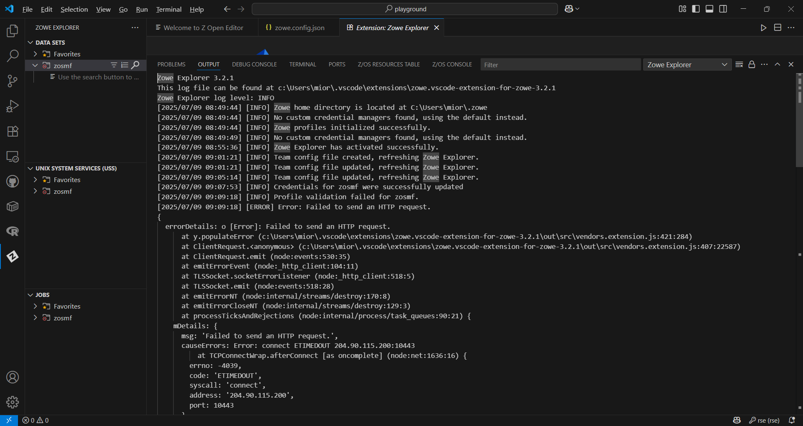
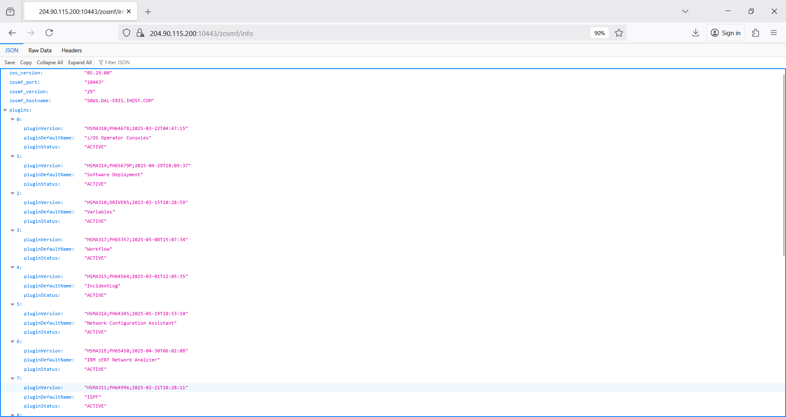
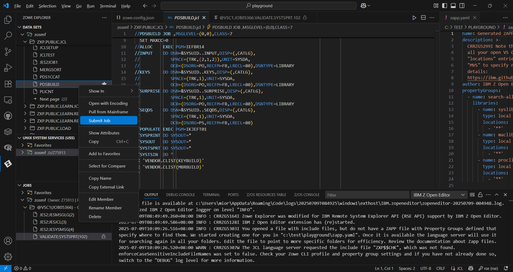
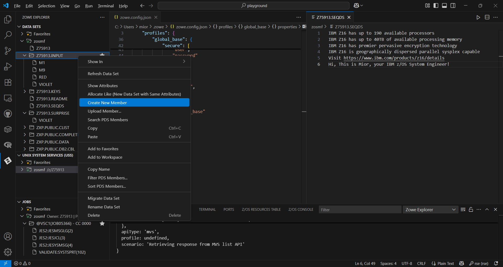
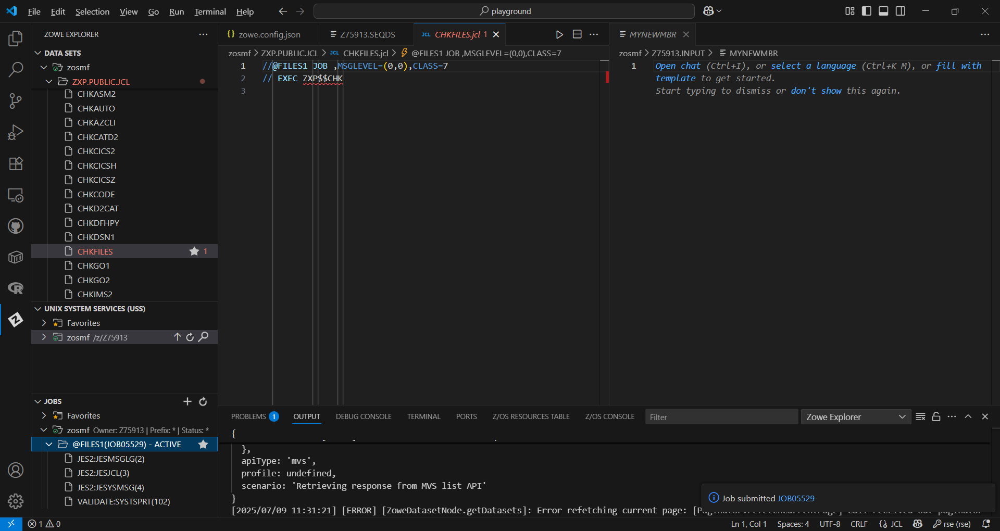
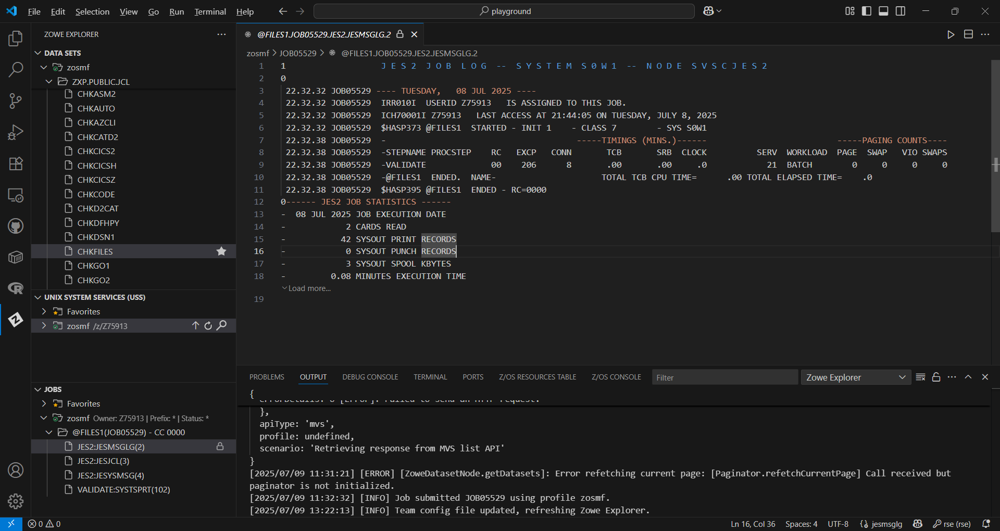
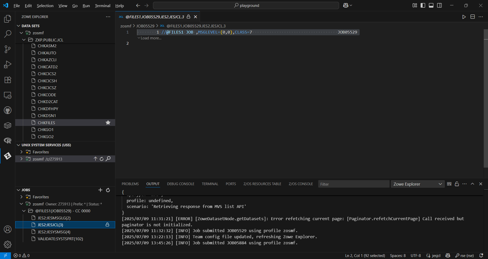
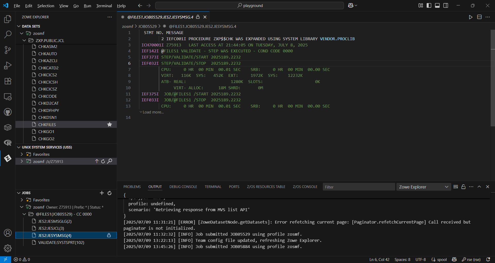

# zosmf-ibm1 💤0️⃣♟️
zosmf-ibm1 : Goverment & Banking # IBM z/OS Mainframe # dataset # jcl # zowe

## Objective
- To setup Zowe Explorer
- perform basic mainframe task such as:
    - working with datasets (SEQDS [sequential] & PDS [partitioned])
    - working with JCL (Job Control Language)

## IBM z/OS Mainframe

